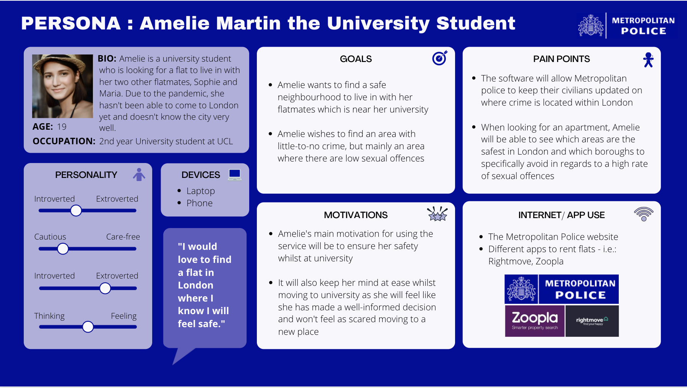

# Visualisations Design Explanations

In this project, we set out to create an insightful and well-functioning Dash App for our dataset. To achieve this, we made three different visualisations to answer our target audience questions.
In coursework 1 of COMP0035, we detailed these questions relating to the Metropolitan Police dataset and have been listed below:

    1. How has drug crime evolved in London over the two recorded years?
    2. Which type of crime is the highest and lowest in London?
    3. How does sexual offence fluctuate over the four seasons?
    4. Which borough has the highest crime rates in London?

To answer these questions, we narrowed the scope of our data exploration to three categories visualisations. These were:

    1. A chloropleth map
    2. A histogram
    3. A line chart

We also found that the standard method of reporting Crime Statistics is with a "Crime Rate per 1000 population" [(UKCrimeStats, 2014)](https://ukcrimestats.com/blog/faqs/what-exactly-does-crime-rate-mean-and-how-do-you-calculate-it/).
Which requires both the number of committed crimes and the area population. However, the given data only provides us with the total number of reported crimes for respective Boroughs, Crime Types, and Months.

So, to provide the target audience relevant statistics they can compare with statistics from other articles or websites, we decided to use two additional datasets:

####Daytime Population by Borough
* The dataset provides us with a Total Daytime Population which includes tourism and Workday Population which excludes them for year 2014. This is 
particularly useful to understand the crime rates of Boroughs that have a high Daytime population but relatively low residential population, 
as it adjusts the reported crimes.
* The dataset does not contain any personal information on persons but rather general statistics on ares in London
* The dataset is licensed under [UK Open Government License](https://www.nationalarchives.gov.uk/doc/open-government-licence/version/2/), which allows for free 
  * Copying, publishing, distributing, and transmitting the Information
  * Adapting the Information
  * Exploiting the Information commercially and non-commercially
* The dataset is available on [London Datastore](https://data.london.gov.uk/dataset/daytime-population-borough)

####Population Density by Borough
* The dataset provides us with GLA estimates for residential population throughout Boroughs and residential population statistics from 2011 Census Data. 
This can be useful to calculate the traditional crime rate statistics per 1000 residents.
* The dataset does not contain any personal information on persons but rather general statistics on ares in London
* The dataset is licensed under [UK Open Government License](https://www.nationalarchives.gov.uk/doc/open-government-licence/version/2/), which allows for free 
  * Copying, publishing, distributing, and transmitting the Information
  * Adapting the Information
  * Exploiting the Information commercially and non-commercially
* The dataset is available on [London Datastore](https://data.london.gov.uk/dataset/land-area-and-population-density-ward-and-borough)

With the population data included the app users will be able to select whichever statistic are most useful to them:
* Raw Reported Numbers of Crimes
* Crime Rate per 1000 residents, adjusted with 2020 GLA resident population estimate
* Crime Rate per 1000 residents, adjusted with 2011 Census resident population statistics
* Crime Rate per 1000 daytime population, adjusted with Total Daytime Population including tourists
* Crime Rate per 1000 daytime population, adjusted only with Working Daytime Population excluding tourists (which might be most appropriate for COVID-19 Time)

Each of the mentioned visualizations will change based on selected data and are able to answer one or multiple of the aforementioned target audience questions.
To explain the design of our visualizations clearly, we will first obtain a solid understanding of our target audience and their needs.

### 1. Target Audience

Our target audience for the webapp, are university students who are new to London and looking for accommodation. 
They are generally not familiar with population densities, economic conditions, and variations in population composition of London Boroughs, 
as those are recognized as some factors that impact the crime rates by the FBI, so they can struggle to make informed judgements on the safety of Boroughs. 
Therefore, they rely on websites and articles reporting crime rates and quantifying borough safety.

The webapp would be useful to the target audience as it would allow them to explore the claims made by various other sources
and compare those claims with statistics. 

Moreover, based on personal preferences, they would be able to tailor their searches to the crimes they are more concerned about for Boroughs they're interested in,
understand how those crime rates change over seasons/years, and see the crime rate forecasts for the next 6 months.

### 2. Software Engineering Process - CRISP DM

### 3. Visualisation 1: The Map

[Visualisation 1: Link to design explanation and evaluation](../markdown_files/visualisation_1.md)

### 4. Visualisation 2: The Histogram

[Visualisation 2: Link to design explanation and evaluation](../markdown_files/visualisation_2.md)

### 5. Visualisation 3: The Line Chart

[Visualisation 3: Link to design explanation and evaluation](../markdown_files/visualisation_3.md)

### 6. Testing the Dash App

To test the dash app, we came up with 10 separate tests using selenium.
The tests check if the interactivity of Display Settings panel (left) updates the graphs correctly.
They check if the map visual and its statistics are updated correctly when selecting a particular data, crime, time frame, boroughs.
They check if the line visual and its statistics are updated correctly when selecting crime, borough, data.

The histogram part of the app is the only one not tested for, as the elements of the histogram graph don't help distinguish between
when different boroughs and time ranges are selected. This could be improved by implementing different elements in the app that report 
the changes to the histogram, however, due to time constraints we decided not to perform app tests for histogram.

We also created 8 unit tests to test all functions of all() class in visualizations.py file.

It tests if data imports and data reformatting work by checking the data shapes,
if returned crime, borough, date lists are correct. If the get_highlights returns the correct subsection of the
geojson given a particular borough, and if test_map_statistics return the correct specific values.

What is not tested are the functions that return various plotly visualizations.

### 7. Weekly Progress reports

We decided to have a Google doc as a way of reporting what we discussed in the meetings, what we have done, and what we need to do next.
Google doc instead of moodle was used so all teammates have access to the TODO list and can write what they have done / plan to do.
On top of that we had about two meetings per week to catch up and update the TODO list, and we had a WhatsApp group that was used to communicate and help troubleshoot 

The contents of that doc are available bellow:
#### Week 1

#### Week 2

#### Week 3

#### Week 4

#### Week 5

#### Week 6

