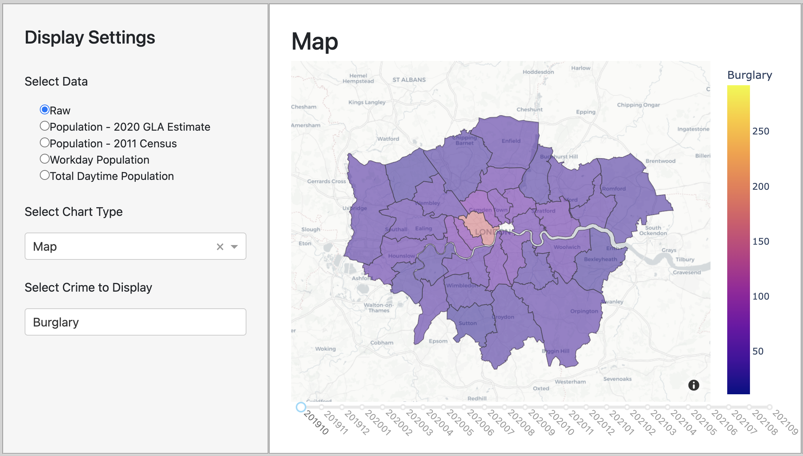

# Visualisation 1: The Map

The target audience for our map visualisation is anyone who is either moving to or living in London and hence, is looking for somewhere to live. The target audience wants to learn and compare the crime rates in the different london boroughs. Furthermore, they are looking for insights into the occurrences of different forms of crime.

The map visualisation is intended to address are the following questions:

    1. How has drug crime evolved in London over the two recorded years?
    2. Which borough has the highest crime rates in London?

### *1. Explaining the design*

We chose to create a map as it is an effective visualisation for our webapp users to compare the London boroughs' crime rates. This is because a map is intuitive and fit for interactivity. 
Simply reading the data in numeric form would make it difficult for users to grasp a true visual understanding of the crime rates in different boroughs as users would not understand the context of each measurement of crime as part of a whole picture in london.
A map allows users to compare the crime rates using a colour spectrum system, where the colour purple signifies a low crime rate and the colour yellow signifies a high crime rate.

We added functionality by providing users with a slider, allowing them to see how the crime rates have evolved over the recorded months.
Therefore, for specific boroughs, users will notice the colour change and gain isight into how crime rate in that area has increased or decreased over a decided time period.

Finally, on the left-hand side of the dashboard, we can see that there is a section enabling users to select filters in relation to the types of crime.
These filters allow our webapp users to tailor their map to their preferences.

### *2. Evaluating our visualisation*

To create the map, we used multiple datasets; the main datasets used were the Metropolitan police dataset (crime_data.csv) and a London Borough dataset (london_boroughs.json) so that we could create the map.
We also used multiple other datasets so that users could look at the map through different data on the population as we can see in the filters on the left-hand side of the dashboard.
The other datasets used were for raw data (population.csv) and total daytime population (daytime_population.csv). 

For the map, we used all the data from each dataset listed above to answer the questions.

The map is extremely useful to the users, as it is the simplest and most interactive way for them to learn about the crime rates in each London borough.
We decided to add a feature where users can hover their mouse over a borough and provide them with (summary)**condensed?? idk what word to use** information on the borough which is the borough name and the amount of crime for the type selected by the user.
If the user wishes to get more in depth information on the borough or boroughs selected, they simply need to click on the borough(s) they are interested in and statistics on the selected borough(s) will show on the right-hand side of the borough.
Th statistics provided show the users by how much the crime rate has changed since the previous month, the last 3 months and from the last year, allowing them to know if the crime rates have improved or gotten worse over the chosen timeframe.
These features are all strengths of the webapp as it allows the user to be provided with global data, which is easy to understand. However, if they wish to have more in depth data, they simply need to click on the borough to see it. 

A weakness of the map is that we are unable to provide users with a map where the date selected is "Today", as we are not provided with the data.
If were able to have access to this data, we would try to improve the map by enabling it to fetch data in real-time and update the map constantly so that users would have access to the latest crime data in the London boroughs.
Moreover, it would have been interesting to be able to compare the London data to other locations within the UK, so that webapp users can have a broader understanding on the crime data to better determine whether the crime rates should be considered as low or high in relation to areas outside of London.
