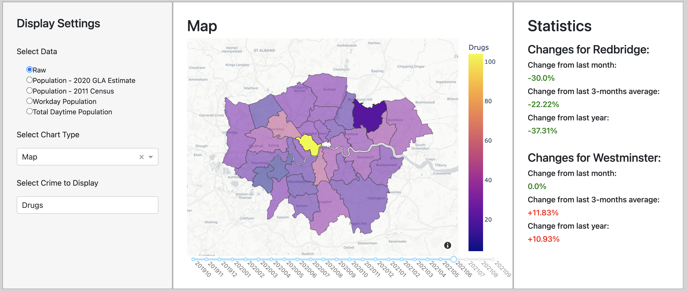

# Visualisation 1: The Map

The target audience for our map visualisation is anyone who is either moving to or living in London and hence, is looking for somewhere to live. who is interested in learning about and comparing the crime rates for each form of crime in the different london boroughs.

The questions that this visualisation is intended to address are the following:

    1. How has drug crime evolved in London over the two recorded years?
    2. Which borough has the highest crime rates in London?

### 1. Explaining the design

We chose to create a map as we believe that it is the most effective visualisation for our webapp users to compare the London boroughs' crime rates. 
Simply reading the data in numeric form would not allow them to grasp an informed understanding on the crime rates as they would not be able to figure out whether the numbers given are supposed to be considered as high or low.
A map allows them to compare the crime rates where on the low end of the spectrum, which is in purple, means that there is a low crime rate and on the high end of the spectrum, which is in yellow, which means that there is a high crime rate.

We also decided to provide our users with a slider, allowing them to see how the crime rates have evolved over the recorded months.
Therefore, if they are looking at a specific borough they are interested in, they can see the colour change and find out if the crime rate in that area has increased or decreased over the months.

Finally, on the left-hand side of the dashboard, we can see that there is a section enabling users to select filters in relation to the types of crime.
These filters allow our webapp users to tailor their map to their preferences.

### 2. Evaluating our visualisation

need to add:

    => what data for the dataset is needed to answer the question (idk if we should add this above before 1. or here)
    => visual aspects of the design (should we put here or in 1.?)
    => How well does the visualisation you created meet with the design choices you made?
    => What are the strengths and weaknesses of the design with respect to the target audience and the question you were intending to answer?
    => If relevant, suggest any ways in which your visualisation design could be improved.