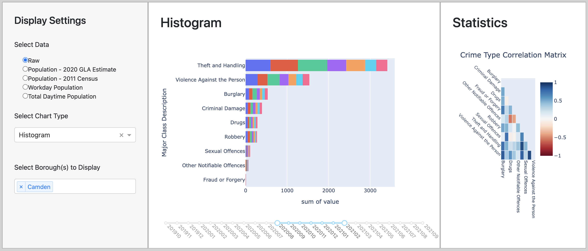

# Visualisation 2: The Histogram

The target audience for our map visualisation is anyone who is either moving to or living in London and hence, is looking for somewhere to live. The target audience wants to learn and compare the crime rates in the different london boroughs. Furthermore, they are looking for insights into the occurrences of different forms of crime.

The question that this visualisation is intended to address is the following:

    1. Which type of crime is the highest and lowest in London?

### *1. Explaining the design*

To answer the question stated above, we decided that a histogram would be the most effective visual.
It allows users to see the counts for each type of crime and compare them with each other, to know which crimes are the highest and lowest in London.

We decided to add a slider allowing users to select a specific time range, within the data we have. 
Therefore, users are able to select a specific timeframe, such as a season, to see whether the crime counts of the different types of crime fluctuate during different periods. 

On the left-hand side of the dashboard, we included filters where users can choose one or multiple boroughs they would like to have shown in the histogram.
This allows them to either look at the crime counts for a specific borough they are interested in or look at the crime counts for a larger area.

### *2. Evaluating the design*

To create the histogram, we used multiple datasets; the main dataset used was the Metropolitan police dataset (crime_data.csv).
We also used multiple other datasets so that users could look at the histogram through different data on the population as we can see in the filters on the left-hand side of the dashboard.
The other datasets used were for raw data (population.csv) and total daytime population (daytime_population.csv). 

We used all the data from each dataset listed above to answer the question.

The histogram has many strengths in helping our webapp users understand the crime rates in London. 
They are able to create a histogram where they can select one or multiple boroughs they are interested in.
Each bar in the plot is decomposed in colours based on the timeline selected.
Therefore, if they select a small timeframe, they are able to compare the crime rates during the months for the borough(s) selected.
Furthermore, on the right-hand side of the dashboard we added a correlation matrix so that users can see if there is a correlation between the different types of crime. For example, we see that Burglary and Fraud or Forgery have a strong positive correlation.
We decided to add this feature into our dashboard so that our users can have more knowledge on crime rates within London.

One of the weaknesses of our histogram is that if the user selects a large timeframe (i.e.: more than 6 months) it becomes hard for them to compare the months, especially for the forms of crime which have a lower count.
This is why we decided that this visualisation would not be able to answer the questions 1. and 3. stated in the design_explanation.md [(Click to see the questions in the main markdown)](../markdown_files/design_explanation.md).
To solve the issue and improve our visualisation, we would probably allow users to click on the histogram itself for it to take up the whole page of the webapp. 
This means that they would be able to better compare the months as the histogram would be larger and therefore allowing them to select a larger timeframe.