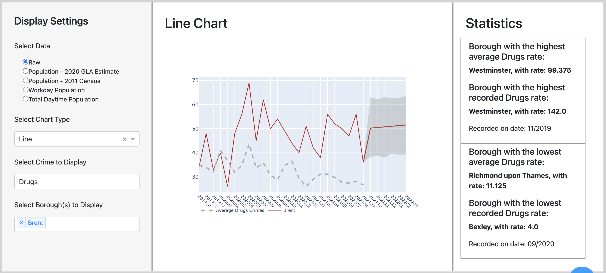

# Visualisation 3: The Line Chart

The target audience for our map visualisation is anyone who is either moving to or living in London, who is interested in learning about and comparing the crime rates for each form of crime in the different london boroughs.

The line chart visualisation is intended to address are the following questions:

    1. How has drug crime evolved in London over the two recorded years?
    2. How does sexual offences fluctuate over the four seasons?

### *1. Explaining the design*

We created a line chart in order to answer the two questions previously stated. 
The line chart allows users to see the fluctuation of the incidents of a crimes over months, which could allow them to observe a pattern seasonally.

Once again, we included the option to select filters on the left-hand side of the dashboard, where users are able to specify which crime they are interested in gaining insights on.
This aspect provides our webapp users with the option to personalise their crime searches.

### *2. Evaluating the design*

To create the line chart, we used multiple datasets. The main dataset used was the Metropolitan police dataset (crime_data.csv).
We also used other datasets so that users could look at the line chart through different population data as we can see in the filters on the left-hand side of the dashboard.
The other datasets used were for raw data (population.csv), population - 2020 GLA estimate (pop2020_df_r.json), population - 2011 Census (pop2011_df_r.json), workday population (workday_df_r.json), predictions made with fbprophet (df_r.json) and total daytime population (daytime_df_r.json and daytime_population.csv). 

We used the multiple datasets to provide a line chart visualisation that answers all the aforementioned target audience questions.

Webapp users are able to select a form of crime as well as one or multiple boroughs.
For each form of crime, we added a line which shows the average crime rate for the corresponding form of crime.
Then, for each form of crime we have a personalised line which shows the counts of crime over the months recorded.
However, in the dataset provided, there were missing counts for some of the most recent months. 
We overcame this obstacle by forecasting the data for the more recent months by also adding upper and lower bounds.
This visualisation is the optimal one to answer the questions is relation to measure the evolution of crime over the recorded months as it shows the webapp users the fluctuation of the crime count.
On the right-hand side of the dashboard we also included statistics showing the boroughs with the highest and lowest average and recorded crime rates for the form of crime selected by the user. 
This is useful as it allows users to compare the boroughs they selected with the extremes of the form of crime selected.

Although the feature where users are able to add multiple boroughs is useful for them to compare the crime rates across the timeline, adding multiple boroughs to the line chart makes it a lot messier and confusing. 
Our solution to this weakness of the visualisation would probably be to limit the number of boroughs users can select to three. 
Another weakness would be that we didn't create the option to look at the line chart data seasonally. 
By providing a simple line chart in addition to the one we created with a timeline which only shows the average data across the four seasons would allow for the users to see whether the seasons have an impact on crime rates.
