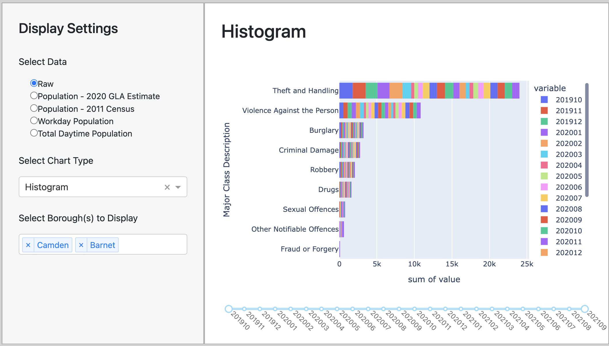

# Visualisation 2: The Histogram

The target audience for our map visualisation is anyone who is either moving to or living in London, who is interested in learning about and comparing the crime rates for each form of crime in the different london boroughs.

The question that this visualisation is intended to address is the following:

    1. Which type of crime is the highest and lowest in London?

### 1. Explaining the design

### 2. Evaluating the design
