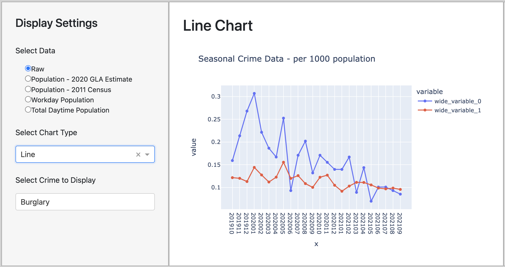

# Visualisation 3: The Line Chart

The target audience for our map visualisation is anyone who is either moving to or living in London, who is interested in learning about and comparing the crime rates for each form of crime in the different london boroughs.

The questions that this visualisation is intended to address are the following:

    1. How has drug crime evolved in London over the two recorded years?
    2. How does sexual offences fluctuate over the four seasons?

### 1. Explaining the design

### 2. Evaluating the design